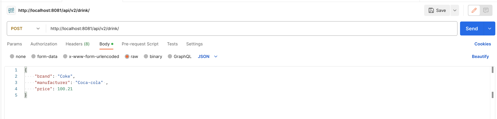

# Documentation

This is the documentation of the store application project that I want to start soon. It will
carry a limited amount of goods that can be queried.
Here is the list of the products to be listed in the store: Bread, Drink, Milk, Pepper, Rice, Strawberry

                                Technology Stack 
    The technology I will be using in the project will be as follows:
        For the backend I will be using Java springboot, mysql.
        For the version control I will be using github and maybe github actions.

                              The RESTful APIs.
## TECH STACK
* Java
* Spring Boot

## Build Tool
* Gradle

## Dependencies
* Spring starter jpa
* Spring starter web
* Spring starter jdbc
* H2 Database
* MockMVC

## Postman Recording
<video width="640" height="360" controls>
  <source src="/image/EndpointTesting.mp4" type="video/mp4">
  Your browser does not support the video tag.
</video>

## Postman Create and Read Endpoints

